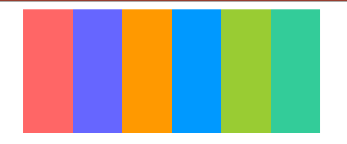

##### 手风琴案例

其特点是鼠标悬浮到组件的某个部分，该部分就会扩张开来并挤压旁边的部分，当鼠标离开时就恢复原
状。若鼠标快速在其上鼠略过，就会产生 手风琴 弹琴的效果。

核心代码：
```scss
li{
  // 鼠标未悬停
  &:hover{
    // 悬停状态
  }
}
```
实现代码看 accordion.html          
[在线codepen地址](https://codepen.io/yaounder/pen/JjNWGWr) 
